# 🧙 Merlin & Co. Apothecaries — ERD

Entity-relationship diagram for the 12 raw source tables. Same schema in every size tier (`seeds/medium_data/`, `seeds/large_data/`, `seeds/parquet_data/`).

Types shown are the *logical* types staging models should cast to — in the raw CSVs everything arrives as text, and the ⚠️ columns carry deliberate messiness (see [DATA_DICTIONARY.md](DATA_DICTIONARY.md#deliberate-data-quirks-staging-layer-work)).

```mermaid
erDiagram
    %% ================= grimoire_crm (CRM) =================

    raw_customers {
        varchar customer_id PK "WIZ-00001"
        varchar full_name
        varchar email "~2% null"
        varchar home_region "inconsistent codes: NR / nr / Northern Reaches / northern reaches"
        date signed_up_at
        int birth_year
        varchar favored_discipline "mixed case"
    }

    raw_guilds {
        varchar guild_id PK "GLD-01"
        varchar guild_name
        int founded_year
    }

    raw_guild_memberships {
        varchar membership_id PK "MEM-00001"
        varchar customer_id FK
        varchar guild_id FK
        varchar tier "mixed case: apprentice / Adept / ARCHMAGE"
        date valid_from
        date valid_to "null = current row (SCD2)"
    }

    %% ================= abra_pos (point-of-sale) =================

    raw_potions {
        varchar potion_sku PK "POT-0001"
        varchar potion_name
        varchar category "mixed case: Healing / Clarity / Luck / Strength / Invisibility / Love"
        int base_price_copper "100 copper = 1 gold crown"
        int potency "1-10"
        int shelf_life_days
        varchar is_regulated "messy boolean: Y / N / yes / no / TRUE / FALSE"
        date introduced_at
    }

    raw_orders {
        varchar order_id PK "ORD-000001"
        varchar customer_id FK
        varchar shop_id FK
        timestamp ordered_at "two formats: ISO-Z and space-separated"
        varchar status "mixed case: completed / returned / cancelled / placed"
        varchar channel "in_store / courier_owl / marketplace"
        int discount_copper
    }

    raw_order_items {
        varchar order_item_id PK "ITM-000001"
        varchar order_id FK
        varchar potion_sku FK
        int quantity "1-5, skewed to 1"
        int unit_price_copper "price at time of sale"
    }

    raw_payments {
        varchar payment_id PK "PAY-000001"
        varchar order_id FK
        varchar method "coin / guild_credit / crystal_transfer / barter"
        int amount_copper "success rows sum to order total"
        varchar status "success / failed / refunded"
        timestamp paid_at "two formats"
    }

    %% ================= alembic_ops (production and procurement) =================

    raw_shops {
        varchar shop_id PK "SHP-01"
        varchar shop_name
        varchar city
        varchar region "canonical spelling - 5 regions, 3 shops each"
        date opened_at
    }

    raw_suppliers {
        varchar supplier_id PK "SUP-01"
        varchar supplier_name
        varchar region
        int reliability_rating "1-5"
        date contracted_since
    }

    raw_ingredients {
        varchar ingredient_id PK "ING-001"
        varchar ingredient_name
        varchar supplier_id FK
        varchar unit "mixed case: gram / sprig / vial / pinch / dram / bundle"
        int unit_cost_copper
        varchar is_hazardous "messy boolean"
        varchar harvest_season
    }

    raw_potion_ingredients {
        varchar potion_sku PK, FK "composite PK (recipe bridge)"
        varchar ingredient_id PK, FK "composite PK"
        int quantity
        varchar unit "mixed case"
    }

    raw_brew_events {
        varchar brew_id PK "BRW-00001"
        varchar potion_sku FK
        varchar shop_id FK
        varchar cauldron_id "CDR-01, not a dimension table"
        timestamp brewed_at "two formats"
        int batch_size
        int brew_duration_minutes "~1% null"
        varchar quality_check "mixed case: pass / fail"
        varchar brewer_name
    }

    %% ================= relationships =================

    raw_customers ||--o{ raw_orders : "places"
    raw_customers ||--o{ raw_guild_memberships : "holds"
    raw_guilds ||--o{ raw_guild_memberships : "grants"
    raw_shops ||--o{ raw_orders : "fulfills"
    raw_orders ||--|{ raw_order_items : "contains (1+)"
    raw_orders ||--o{ raw_payments : "paid by (0 for some cancelled)"
    raw_potions ||--o{ raw_order_items : "sold as"
    raw_potions ||--|{ raw_potion_ingredients : "made from (2-5)"
    raw_ingredients ||--o{ raw_potion_ingredients : "used in"
    raw_suppliers ||--o{ raw_ingredients : "supplies"
    raw_potions ||--o{ raw_brew_events : "brewed in"
    raw_shops ||--o{ raw_brew_events : "hosts"
```

## Key facts

- **Grain**: `raw_orders` = one row per order; `raw_order_items` = one row per potion per order (no repeated SKU within an order); `raw_payments` = one row per payment attempt (splits, failures, and refunds each get their own row); `raw_guild_memberships` = one row per customer-guild-tier interval; `raw_brew_events` = one row per production batch.
- **Referential integrity is intact everywhere** — no orphaned FKs, no duplicate PKs. The messiness is in formats and casing, not broken joins.
- **The region bridge**: `raw_shops.region` is canonical; `raw_customers.home_region` is inconsistently coded. Conforming the two is intended staging work, and `orders → shops.region` is the path revenue-by-region takes to the Semantic Layer.
- **`raw_potion_ingredients`** has no surrogate key in the raw feed — its natural key is the composite (`potion_sku`, `ingredient_id`).
